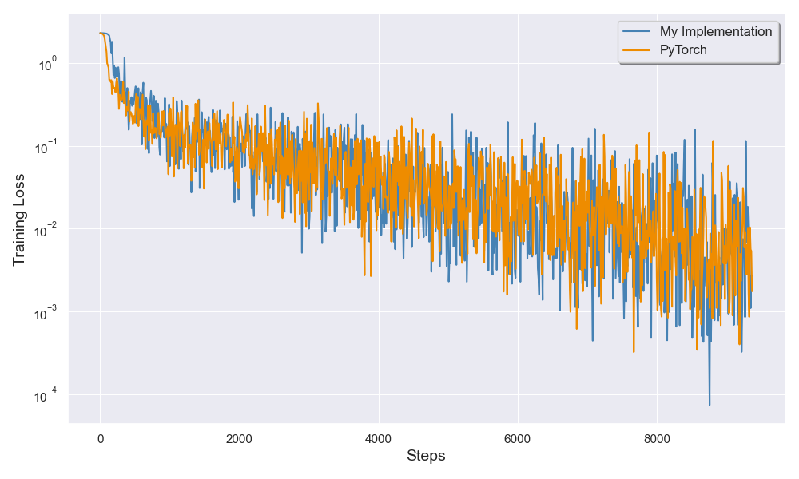
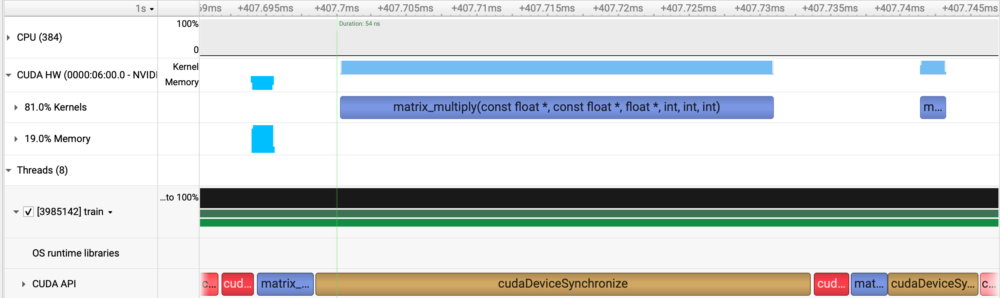
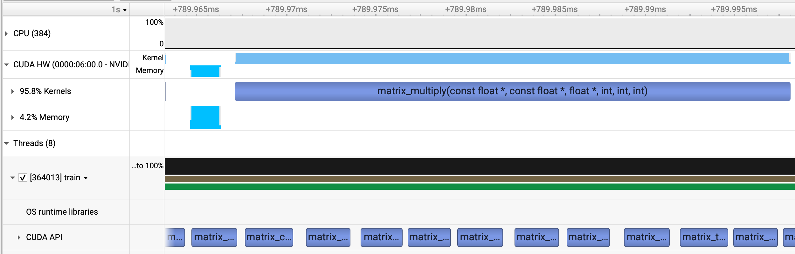

# Cuda MLP

This project trains an MLP on MNIST in pure CUDA/C++. It aims to be simple whilst replicating the general structure of PyTorch-style ML frameworks.

## Usage

Build project with:

```bash
make clean && make all
```

Launch training run with:

```bash
build/train <path_to_config> # custom allocator
ALLOCATOR_TYPE=cuda build/train <path_to_config> # CUDA Stream Ordered Allocator
```

For accurate timing information, I suggest doing:

```bash
tools/throughput_test_wrapper.sh build/train <path_to_config>
```

This fixes GPU clock speeds, ensuring more repeatable timing information.


## Accuracy

The following plot shows training loss for my implementation, and PyTorch. The performance is almost identical.




## Speed

This project is not designed to be ultra-efficient. For example, its CUDA kernels are entirely unoptimised. That being said, it does implement a custom memory allocator since this is a key feature of popular deep learning frameworks.

It's also much quicker than PyTorch for small models. A single epoch (including validation) takes ~750ms on an H100 for a model with 4 layers and a hidden dimension of 784. By comparison, PyTorch achieves ~3.6s per epoch (with `torch.compile` enabled and allowing for a warmup phase). **This custom implementation is >4x quicker**, presumably because it avoids any Python interpreter overhead.

### The Need for a Custom Memory Allocator

When launching a CUDA kernel, we must allocate GPU memory for the output tensor with a call to `cudaMalloc`. This forces a host-device synchronisation.

This is bad for GPU utilisation. As a workaround, popular deep learning frameworks manage their own "pool" of GPU memory, thus avoiding repeated calls to `cudaMalloc`/`cudaFree`. Examples include [PyTorch's CUDA Caching Allocator](https://zdevito.github.io/2022/08/04/cuda-caching-allocator.html) and [Tensorflow's BFC Allocator](https://github.com/sourcecode369/tensorflow-1/blob/master/tensorflow/core/common_runtime/bfc_allocator.cc).

Here's an illustration of the problem:



In this diagram, we run a matmul followed by a ReLU. In the CUDA API stream we see `cudaMalloc` calls in red, and kernel invocations in blue.

After implementing our custom allocator, CUDA kernels are launched asynchronously:



Logging each call to `cudaMalloc` shows that it is only called during the first epoch:

```
Calling allocate, cudaMalloc
...
Calling allocate, cudaMalloc
Epoch 1/10
Calling allocate, cudaMalloc
...
Calling allocate, cudaMalloc
Validation Loss after epoch 1: 0.167855
Validation Acc after epoch 1: 94.84%
Epoch 2/10
Validation Loss after epoch 2: 0.109865
Validation Acc after epoch 2: 96.42%
Epoch 3/10
...
```

## Dependencies

I've tried to keep the number of dependencies as small as possible. Currently, the required dependencies are:

* `wget` (to download MNIST).
* [matplotlib](https://pypi.org/project/matplotlib/) and [seaborn](https://pypi.org/project/seaborn/) (for plotting loss curves).

## TODO

* Compare my throughput with PyTorch for various model sizes.
* Add loss curves for various model sizes.
