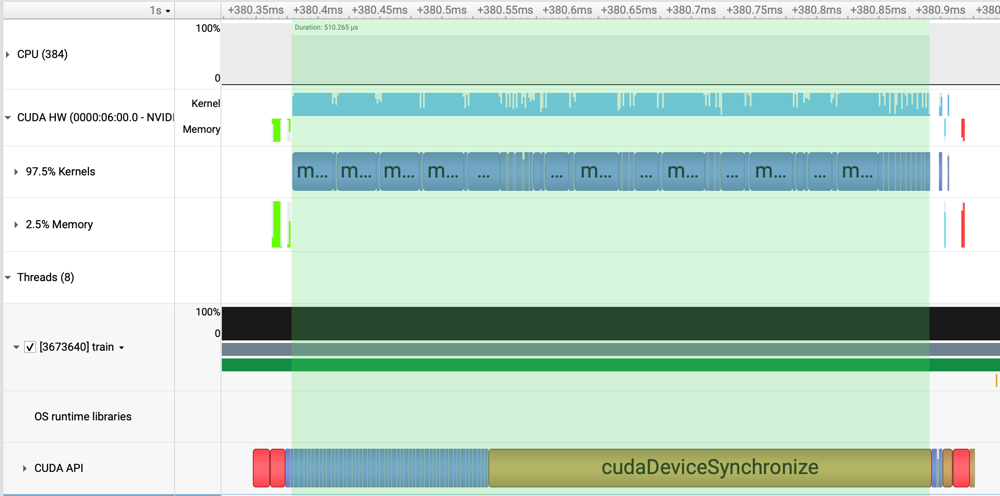
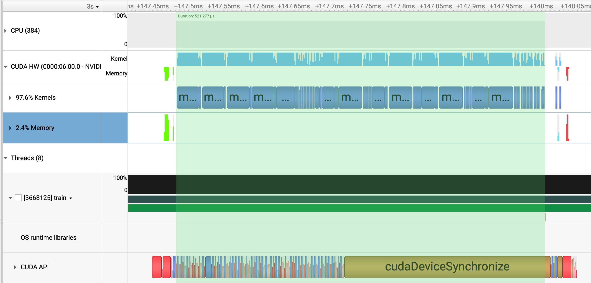

# Cuda MLP

This project trains an MLP on MNIST in pure CUDA/C++. It aims to be simple whilst replicating the general structure of PyTorch-style ML frameworks.

## Accuracy

The following plot shows training loss for my implementation, and PyTorch. The performance is almost identical.


## Speed

This project is not designed to be ultra-efficient. For example, its CUDA kernels are entirely unoptimised. That being said, it does implement a custom memory allocator since this is a key feature of popular deep learning frameworks.

It's also much quicker than PyTorch for small models. A single epoch (including validation) takes ~750ms on an H100 for a model with 4 layers and a hidden dimension of 784. By comparison, PyTorch achieves ~3.6s per epoch (with `torch.compile` enabled and allowing for a warmup phase). **This custom implementation is >4x quicker**, primarily because it avoids any Python interpreter overhead.

## The Need for a Custom Memory Allocator

When launching a CUDA kernel, we must allocate GPU memory for the output tensor with a call to `cudaMalloc`. This forces a host-device synchronisation.

This is bad for GPU utilisation. As a workaround, popular deep learning frameworks manage their own "pool" of GPU memory, thus avoiding repeated calls to `cudaMalloc`/`cudaFree`. Examples include [PyTorch's CUDA Caching Allocator](https://zdevito.github.io/2022/08/04/cuda-caching-allocator.html) and [Tensorflow's BFC Allocator](https://github.com/sourcecode369/tensorflow-1/blob/master/tensorflow/core/common_runtime/bfc_allocator.cc).

Here's an illustration of the problem:


In this diagram, we run a matmul followed by a ReLU. In the CUDA API stream we see `cudaMalloc` calls in red, and kernel invocations in blue.

After implementing our custom allocator, CUDA kernels are launched asynchronously:


Logging each call to `cudaMalloc` shows that it is only called during the first epoch:

```
Calling allocate, cudaMalloc
...
Calling allocate, cudaMalloc
Epoch 1/10
Calling allocate, cudaMalloc
...
Calling allocate, cudaMalloc
Validation Loss after epoch 1: 0.167855
Validation Acc after epoch 1: 94.84%
Epoch 2/10
Validation Loss after epoch 2: 0.109865
Validation Acc after epoch 2: 96.42%
Epoch 3/10
...
```

## Comparison to the Stream Ordered Memory Allocator
CUDA provides its own solution to synchronising `CudaMalloc`/`CudaFree` calls in the form of `CudaMallocAsync`/`cudaFreeAsync`. They call this the [Stream Ordered Memory Allocator](https://developer.nvidia.com/blog/using-cuda-stream-ordered-memory-allocator-part-1/). The idea is identical to any custom memory allocator. The memory pool is handled by the CUDA driver.

This project supports `CudaMallocAsync`/`cudaFreeAsync` in addition to its custom memory allocator. There are two points of note regarding the implementation.

First, unused memory accumulated in the pool is by default returned to the OS at each host-device synchronisation. This is clearly suboptimal since it'll prevent our pool from reaching a steady state. As a solution, we set `cudaMemPoolAttrReleaseThreshold` to its max value (`UINT64_MAX`). This guarantees memory won't be released prematurely.

Second, as Nvidia [describe](https://developer.nvidia.com/blog/using-cuda-stream-ordered-memory-allocator-part-1/#retaining_memory_in_the_pool):

> The pool threshold is just a hint. Memory in the pool can also be released implicitly by the CUDA driver to enable an unrelated memory allocation request in the same process to succeed.

For this reason, we must ensure that this project makes no calls to `cudaMalloc`/`cudaFree`. All allocation/free calls operations must be handled by our memory allocator object.

Let's now comparing the throughputs of our two allocators for a model with `feat_dim=784`, `num_layers=4`:

```bash
# Custom Allocator
Epoch 1 took 844 ms
Epoch 2 took 843 ms
Epoch 3 took 843 ms

# CUDA Allocator
Epoch 1 took 882 ms
Epoch 2 took 885 ms
Epoch 3 took 884 ms
```

The two approaches are close but our custom allocator is slightly faster. Digging into this with `nsys`, we see that both allocators enable asynchronous execution. But our custom allocator is slightly faster for each fwd-bwd step. In this example, our custom allocator takes 510 μs:



versus 521 μs for the CUDA allocator:



This 21 μs discrepancy comes from a slightly longer idle time between consecutive kernels when using `cudaMallocAsync` compared to our custom allocator.

Though the exact mechanism would require further investigation, the additional driver-level memory pool operations appear to impact kernel scheduling efficiency. In contrast, our custom allocator operates at the application level, thus removing driver-managed pool operations from the critical path. Of course, this performance difference becomes negligible with larger kernel sizes. Increasing `feat_dim` to `2048`, we see a ~30ms difference between allocator types - similar to above:

```bash
# Custom Allocator
Epoch 1 took 2422 ms
Epoch 2 took 2415 ms
Epoch 3 took 2413 ms

# CUDA Allocator
Epoch 1 took 2449 ms
Epoch 2 took 2442 ms
Epoch 3 took 2440 ms
```


## Dependencies

I've tried to keep the number of dependencies as small as possible. Currently, the required dependencies are:

* `wget` (to download MNIST).
* [matplotlib](https://pypi.org/project/matplotlib/) and [seaborn](https://pypi.org/project/seaborn/) (for plotting loss curves).
